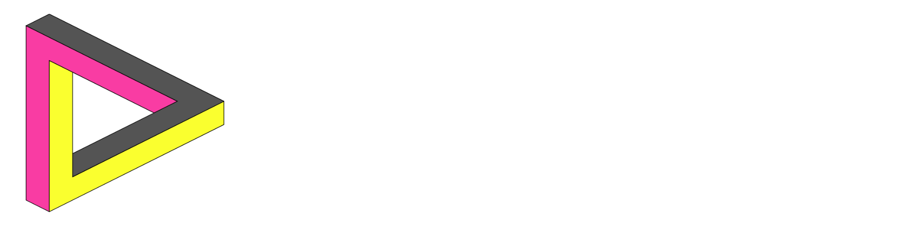

This repository contains the source code for thecoreloop's website.

### Tech Stack
- Frontend: [React](https://react.dev/)
- Backend: [Next](https://nextjs.org/), deployed on [Vercel](https://vercel.com/)
- Database: [PlanetScale](https://planetscale.com/)

### Commit Message Format
Format: `<emoji> <category> [<scope>]: <message>`

| Category   | Use                                                         |
|------------|:------------------------------------------------------------|
| 🏗️ build   | when changing the build system or external dependencies     |
| ✨ feat    | when adding a new feature                                   |
| 📝 docs    | when adding comments or documentation                       |
| 🐛 fix     | when fixing a bug                                           |
| 🎨 styles  | when changing styling of UI elements                        |

