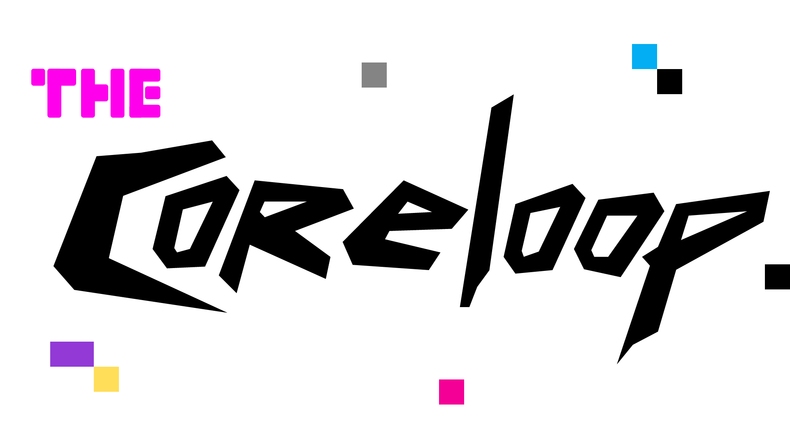

<picture>
    <source
        media="(prefers-color-scheme: dark)"
        srcset="./public/tcl-logo-alt.png"
    >
    <source
        media="(prefers-color-scheme: light)"
        srcset="./public/tcl-logo.png"
    >
    
</picture>

This repository contains the source code for thecoreloop's [website](https://thecoreloop.gg/).

### Tech Stack
- Frontend: [React](https://react.dev/)
- Backend: [Next](https://nextjs.org/), deployed on [Vercel](https://vercel.com/)
- Database: [PlanetScale](https://planetscale.com/)

### Commit Message Format
Format: `<emoji> <category> [<scope>]: <message>`

| Category      | Use                                                     |
|---------------|:--------------------------------------------------------|
| 📦 build      | when changing the build system or external dependencies |
| ✨ feat       | when adding a new feature                               |
| 📝 docs       | when adding comments or documentation                   |
| 🐛 fix        | when fixing a bug                                       |
| 🎨 styles     | when changing styling of UI elements                    |
| 🔁 refactor   | when refactoring source code                            |
